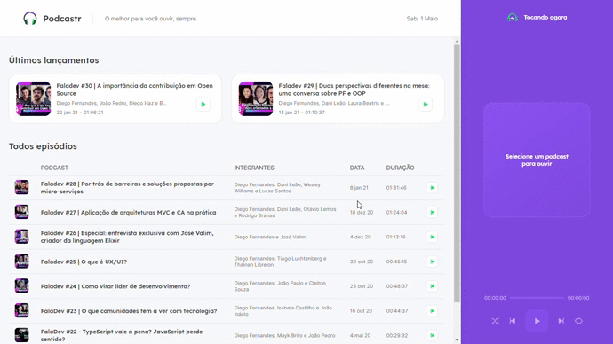

<div align="center" >
  

## Sua plataforma de escutar podcasts.    
</div>

##  Demonstração do Projeto

<div align="center">
    
</div>


## 📑 Sobre

Aplicação web construída na NLW da [Rocketseat](https://github.com/Rocketseat).

- SPA (Single-page application)

## ♻ Recursos

- Plataforma Web para listagem e reprodução de Podcasts.

## 👨‍💻 Tecnologias 

O projeto foi desenvolvido utilizando:

- Next.js
- TypeScript
- SCSS

## 🚀 Como executar o projeto

Ápós baixar o projeto, execute os seguintes passos: 

```bash

    #Entrar na pasta do projeto
    $ cd podcastr/
    
    #Use (npm ou yarn)

    #Instalar as depedências
    $ (npm || yarn) install

    #Executando o Servidor
    $ (npm run || yarn) server
    
    #Executando o Projeto
    $ (npm run || yarn) dev

```

Acesse http://localhost:3000/ e explore o projeto.

## ⚠ Atenção !!!

Se você fechar o terminal que o projeto está sendo executado, ele irá parar de funcionar, e isso vai impedir que você utilize a aplicação Web.

Deixe o terminal aberto após rodar os comandos para executar o projeto.

---

### 💻 Desenvolvido por [Pedro Leonardo](https://github.com/xpedroleonardo). 

### Gostou do projeto ? Dê uma estrela ⭐
